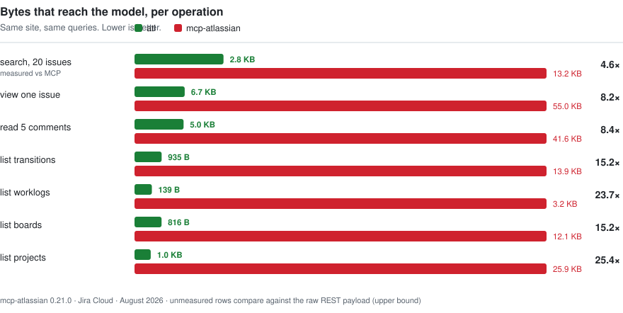
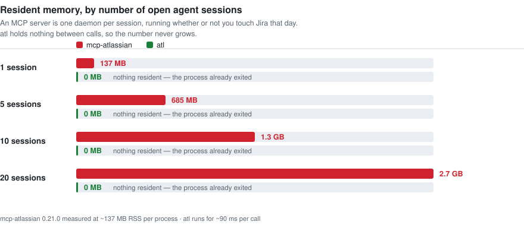
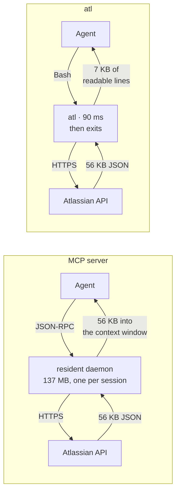

<div align="center">

# Atlassian for Agents

### Jira + Confluence Cloud from your shell — built for AI coding agents

<sub>the command is `atl`</sub>

**A single file. Zero dependencies. No daemon.**
A drop-in replacement for the [mcp-atlassian](https://github.com/sooperset/mcp-atlassian) MCP server that puts **5–25× fewer tokens** in your model's context.

[](https://github.com/AlexSerbinov/atlassian-cli-for-agents/actions/workflows/test.yml)
[](LICENSE)
[](https://www.python.org/)
[](pyproject.toml)
[](#contributing)

</div>

---

```console
$ atl issue PROJ-1257
PROJ-1257  Generated API types cannot be regenerated — minified DTO names are unstable
  status:   In testing   type: Task   prio: Medium
  assignee: Jane Doe     reporter: Alex M.
  labels:   backend, frontend, tech-debt
  time:     spent 30m  est —
  url:      https://acme.atlassian.net/browse/PROJ-1257

--- description ---
## Problem
`npm run generate:admin` cannot be run. Regenerating the types produces a
+5295 / −3307 diff and 117 `tsc` errors — not because the API changed …
```

That is the entire response. The same call through an MCP server returns **56 KB of JSON**, and your model reads every byte.

<div align="center">

|  |  |
|:--|:--|
| 🪶 **One file, no dependencies** | 62 KB of stdlib Python. Vendor it, read it, patch it. |
| ⚡ **No resident process** | Starts in ~90 ms, works, exits. Not 137 MB × every open tab. |
| 📉 **5–25× fewer tokens** | The shell filters, not the model. |
| 🔓 **Does what MCP can't** | Edit/delete worklogs, upload Jira attachments, transition **with** a comment. |
| 🔐 **Token never hits `ps`** | Read from a 0600 file into one header. A test enforces it. |

</div>

---

## Why this exists

MCP is a fine protocol. For a REST API an agent hits dozens of times a day, it has three costs that compound.

### 1. Every response is raw JSON, and the model reads all of it

<div align="center">
  <picture>
    <source media="(prefers-color-scheme: dark)" srcset="docs/assets/tokens-dark.svg">
    
  </picture>
</div>

The gap is not compression. Here is **one row** of a twenty-row MCP search result:

```json
{
  "id": "27714", "key": "PROJ-738",
  "summary": "User message is not delivered to manager …",
  "status": { "name": "Release branch", "category": "In Progress", "color": "yellow" },
  "issue_type": { "name": "Bug" }, "priority": { "name": "High" },
  "assignee": {
    "display_name": "Jane Doe", "name": "Jane Doe", "email": "jane@acme.com",
    "avatar_url": "https://avatar-management--avatars.us-west-2.prod.public.atl-paas.net/557058:1a2b…/aaaaaaaa-…/48"
  }
}
```

That `avatar_url` is 200 characters. It repeats **identically on all twenty rows**, for the same person. `atl` prints one line:

```
PROJ-738   Release branch  Bug   Jane Doe   User message is not delivered to manager …
```

With a CLI, `jq`, `grep` and `head` do the filtering in the shell — intermediate JSON never enters the context window at all.

### 2. One resident daemon per editor session

<div align="center">
  <picture>
    <source media="(prefers-color-scheme: dark)" srcset="docs/assets/memory-dark.svg">
    
  </picture>
</div>

### 3. Tool schemas are not free

mcp-atlassian exposes **72 tools**. Their descriptions and parameter schemas total ~141 KB — roughly **35,000 tokens** if a client loads them all. Clients that defer schemas pay only for what gets used, but that is still ~700 tokens per tool touched, plus the always-present list of 72 names.

The agent guide shipped here is **9 KB ≈ 2,300 tokens**, loaded once, and documents all 46 commands.

---

## The architectural difference in one picture



The filtering has to happen somewhere. The only question is whether the model pays for it.

---

## What it does that mcp-atlassian cannot

Not efficiency wins — operations with **no MCP tool at all**, verified against mcp-atlassian 0.21.0 source.

| Operation | mcp-atlassian | `atl` |
|:--|:--|:--|
| **Edit a worklog** | ❌ only `get` and `add` exist | `atl worklog edit KEY ID --time 2h` |
| **Delete a worklog** | ❌ same | `atl worklog rm KEY ID` |
| **Upload a Jira attachment** | ❌ `upload` appears 0× in `jira.py` | `atl attach KEY shot.png` |
| **Transition + comment** | ❌ *"Operation value must be an Atlassian Document"* | `atl transition KEY --to Done --comment "…"` |
| **Inline images in a description** | ❌ no ADF, no media nodes | `` — uploaded and embedded |
| **Diff two Confluence versions** | raw XHTML | unified diff on rendered Markdown |

That last failure is a symptom of something deeper. Jira REST v3 and Confluence Cloud v2 take rich text as **ADF** — Atlassian Document Format, a JSON tree. A tool that cannot build ADF cannot write a comment, a description, or a page body.

`atl` ships a Markdown ↔ ADF converter that round-trips headings, lists, code blocks with language, blockquotes, rules, links, inline marks and **tables**:

### Screenshots that actually sit in the text

Write ordinary Markdown with local image paths. `atl` uploads each file as an attachment and rewrites it into an ADF media node, so the picture lands **between the paragraphs** rather than as an anonymous file at the bottom of the ticket.

```markdown
## Before


The card rendered with the wrong issuer label.

## After


```

```bash
atl create --project PROJ --type Bug --summary "Wrong issuer label" --description @report.md
atl comment PROJ-123 'verified after the fix

'
atl conf put 12345678 report.md
```

Relative paths resolve next to the `@file.md` they came from, so a document and its screenshots travel together. The same syntax works in descriptions, comments, worklog comments, acceptance criteria and Confluence pages. Remote `https://` images stay links — Jira accepts an external media node but does not render it, and a link that works beats an image that silently does not.

<sub>Under the hood: Jira validates that a media node points at a real media-services file and exposes that UUID nowhere in its REST fields — `atl` recovers it from the 303 redirect on the attachment content endpoint. Confluence hands back `fileId` and `collectionName` directly. Both paths are verified against the live API.</sub>

```console
$ atl conf diff 12345678
--- v2
+++ v3
@@ -1,8 +1,7 @@
 # Release checklist

-Second version — line changed.
+Third version.

 - alpha
-- beta
 - gamma added
```

---

## Install

```bash
# curl — one file, nothing else
curl -fsSL https://raw.githubusercontent.com/AlexSerbinov/atlassian-cli-for-agents/main/atl \
  -o ~/.local/bin/atl && chmod +x ~/.local/bin/atl

# or pip
pip install atl-cli
```

### Get a token

1. Open **[id.atlassian.com/manage-profile/security/api-tokens](https://id.atlassian.com/manage-profile/security/api-tokens)**
   — or: your avatar → **Manage account** → **Security** → **Create and manage API tokens**.
2. **Create API token**, label it `atl`, pick an expiry (1 day – 1 year).
3. **Copy it now.** Atlassian shows it exactly once and cannot show it again.

### Point atl at it

```bash
atl init    # asks for site, email, and where to keep the token
atl me      # verify
```

```console
$ atl me
Jane Doe <jane@acme.com>
accountId: 557058:1a2b3c4d-…
site:      https://acme.atlassian.net
```

### Keep it somewhere sensible

An API token does everything your account can, in every project you can see. `atl` never
requires you to store it in a file it owns — point it at your password manager instead:

```json
{
  "url": "https://acme.atlassian.net",
  "user": "jane@acme.com",
  "token_command": "op read op://Private/atl/credential"
}
```

Anything that prints the token on stdout works — 1Password, `pass`, gopass, Vault, macOS
Keychain, GNOME Keyring. `atl` runs it, reads the output, and never learns where the secret
actually lives. `atl init` writes the keychain recipe for your platform for you.

The plain `"token": "…"` form still works and is written mode `600`; `atl` re-checks those
permissions on every run and warns if the file becomes readable by others. For CI, use
`ATL_URL` / `ATL_USER` / `ATL_TOKEN` and a
[service account](https://support.atlassian.com/user-management/docs/manage-api-tokens-for-service-accounts/).

Resolution order: `~/.atl.json` → `ATL_TOKEN` → `token_command` → `~/.jira-api-token` → a legacy mcp-atlassian entry.

> [!TIP]
> **Coming from mcp-atlassian?** Skip `atl init` entirely. If the `atlassian` server is still in your `~/.claude.json`, `atl` reads those credentials directly and works with **zero configuration**. Remove the server once you are satisfied.

> [!NOTE]
> Want least privilege? Atlassian's **scoped** tokens work too, but they are only valid
> against `api.atlassian.com`. Run `atl init --scoped` — it reads your site's cloud id and
> routes API calls through the gateway while keeping browse links on your site.

🔐 **[Full setup and token-storage guide →](docs/setup.md)** — step by step, every storage
option with copy-paste recipes, scoped-token scopes, and a troubleshooting table.

---

## Use it

Compact output by default. `--json` gives the untouched payload and works **before or after** the subcommand.

<details open>
<summary><b>Work items</b></summary>

```bash
atl issue PROJ-123                   # compact view, description as Markdown
atl issue PROJ-123 --full            # every field, including custom fields
atl search 'assignee = currentUser() AND statusCategory != Done' --limit 20

atl create --project PROJ --type Task --summary "…" --description @body.md \
           --assignee me --labels backend --sprint 118
atl edit PROJ-123 --summary "…" --priority High
atl assign PROJ-123 "Jane Doe"       # display name or email; `none` unassigns
atl link PROJ-123 --to PROJ-124 --type Blocks
atl delete PROJ-123 --subtasks
```

`--description`, `--comment` and worklog comments take inline Markdown or `@path/to/file.md`. Use `@file` for anything long — it keeps the body out of your shell history.
</details>

<details>
<summary><b>Statuses and comments</b></summary>

```bash
atl transitions PROJ-123                      # what is reachable now, with ids
atl transition PROJ-123 --to "In Progress"    # fuzzy match on the target status
atl transition PROJ-123 --to Done --comment "shipped in v2.7.4"

atl comment PROJ-123 'text with **markdown**'
atl comments PROJ-123 --limit 5
atl comment-edit PROJ-123 34277 'rewritten'
atl comment-rm PROJ-123 34277
```
</details>

<details>
<summary><b>Worklogs and time reports</b></summary>

```bash
atl worklog list PROJ-123 [--mine]
atl worklog add  PROJ-123 2h30m --date 2026-08-22 --at 10:00:00 --comment "…"
atl worklog edit PROJ-123 47005 --time 2h
atl worklog rm   PROJ-123 47005
atl report 2026-08-10 2026-08-14              # per-day totals with delta to target
```

Durations: `2h30m`, `1d`, `45m`, `1w2d`; a bare number is minutes. Jira's workday is 8h and its week 5d, so `1d` = 8h. `--date` defaults to today, so pass it explicitly for past days — and the local UTC offset is attached automatically, because Jira rejects a naive timestamp.
</details>

<details>
<summary><b>Sprints, boards, attachments</b></summary>

```bash
atl boards --project PROJ
atl sprint current 42                         # id of the board's active sprint
atl sprint add current PROJ-123 PROJ-124 --board 42
atl sprint backlog PROJ-123
atl sprint create --board 42 --name "Sprint 20" --start 2026-08-24 --end 2026-09-07

atl attach PROJ-123 shot.png notes.pdf
atl download PROJ-123 --name shot --dest ./tmp
atl attach-rm 29566
```
</details>

<details>
<summary><b>Confluence</b></summary>

```bash
atl conf search 'title ~ "Backend" order by lastmodified desc'
atl conf get 12345678                         # page as Markdown
atl conf create --space DOCS --title "Notes" body.md
atl conf put 12345678 body.md --message "why this edit"

atl conf comments 12345678                    # threads, replies indented
atl conf comment 12345678 'text'
atl conf reply 87654321 'threaded reply'

atl conf history 12345678
atl conf diff 12345678 --from 1 --to 3
atl conf labels 12345678
```
</details>

### Compose it

The point of a CLI is that the shell does the work:

```bash
# total logged on an issue, in hours
atl worklog list PROJ-123 --json | jq '[.[].timeSpentSeconds] | add / 3600'

# move everything ready for QA into the active sprint
atl search 'project = PROJ AND status = "Ready for QA"' --json \
  | jq -r '.[].key' | xargs atl sprint add current --board 42

# what did I actually do last week
atl report 2026-08-17 2026-08-21
```

---

## Wiring it into an agent

```bash
cp -r skills/atlassian-cli ~/.claude/skills/
```

That is a [Claude Code skill](skills/atlassian-cli/SKILL.md): one 9 KB document the agent reads once, after which it knows all 46 commands. For other agents, point them at that file or at `atl --help`.

There is no protocol to implement and no server to run. Your agent already knows how to run shell commands.

---

## When you should use mcp-atlassian instead

`atl` implements ~35 of mcp-atlassian's 72 tools — the ones that carry day-to-day work. It does **not** cover:

<div align="center">

| Area | Status |
|:--|:--|
| Jira Service Desk — queues, SLA, request types | ❌ |
| Proforma forms | ❌ |
| Watchers · versions & releases · development info | ❌ |
| Batch create · remote links · project components | ❌ |
| Confluence page move · user search · view analytics | ❌ |
| **Server / Data Center** deployments | ❌ Cloud only |
| **OAuth 2.0** | ❌ API token only |

</div>

If your workflow lives in Service Desk or Proforma, use mcp-atlassian — it is a good project with far broader coverage. If it is issues, comments, worklogs, sprints and pages, `atl` covers it at a fraction of the cost. Nothing stops you running both; they read the same API with the same token.

Server/DC users who want the CLI approach should look at [atlassian-skills](https://github.com/eunsanMountain/atlassian-skills).

📊 **[Full tool-by-tool comparison →](docs/comparison.md)**

---

## Security

The token is read from `~/.atl.json` (mode 600) at call time and used only to build a `Basic` auth header. It is never printed, never logged, and **never becomes a process argument**.

That last point is not theoretical. An MCP server configured the usual way takes its credentials as command-line flags — which means your Jira token sits in `ps aux`, readable by every process on the machine, for as long as the daemon runs:

```console
$ ps aux | grep mcp-atlassian
… mcp-atlassian --jira-token=ATATT3xFfGF0EXAMPLE-not-a-real-token-0000000000 --jira-username=you@acme.com
```

This is a property of passing secrets as arguments, not a flaw unique to any project — but it disappears when there is no long-lived process. There is a test that walks the AST and fails the build if the token is ever read outside `_auth_header`.

---

## How it works

One file, ~1,600 lines, standard library only:

```
credentials  →  HTTP (api(), upload())  →  Markdown ↔ ADF  →  helpers
             →  Jira read  →  Jira write  →  worklogs  →  attachments
             →  sprints  →  boards/meta  →  Confluence  →  argparse  →  main()
```

Adding a command is three edits: a `cmd_*(creds, a)` function, a block in `build_parser()`, and a line in this README. `api(creds, path, params, method, body, base=…)` handles auth and JSON in both directions, so most new endpoints are a five-line function.

### Tests

```bash
python -m unittest discover -s tests -v      # 63 tests, no network, no credentials
```

They cover the Markdown-image pipeline (parse, strip, rewrite, remote-URL and missing-file fallbacks), the ADF converter in both directions — including the ADF invariant that a text node may never be empty — round-trip idempotency, duration parsing, timestamp shape, credential resolution across all four sources including `token_command` failure modes, the config-permission warning, scoped-token gateway routing, error unwrapping for **both** the Jira (`errors` as an object) and Confluence (`errors` as a list) shapes, and the token rule above.

CI runs them on Linux and macOS against Python 3.8, 3.11 and 3.13. Every write path was additionally exercised against a live Jira and Confluence Cloud site: create → comment → transition-with-comment → edit → worklog add/edit/delete → attach/download/delete → sprint add/backlog → assign, and page create → read → update → comment → reply → history → diff → label → delete.

---

## Contributing

Issues and PRs welcome. The unimplemented tool categories above are the obvious first contributions, and each is a small, self-contained function.

Three rules, and they are the whole design:

1. **Standard library only.** No dependency is worth the install friction.
2. **One file.** It should stay something you can read in an afternoon and vendor without thinking.
3. **Compact by default, raw on `--json`.** Never hand-build ADF — call `md_to_adf()` and `adf_to_md()`.

<div align="center">

**MIT licensed** · [LICENSE](LICENSE)

*If this saved you a few hundred thousand tokens, a ⭐ helps other people find it.*

</div>
